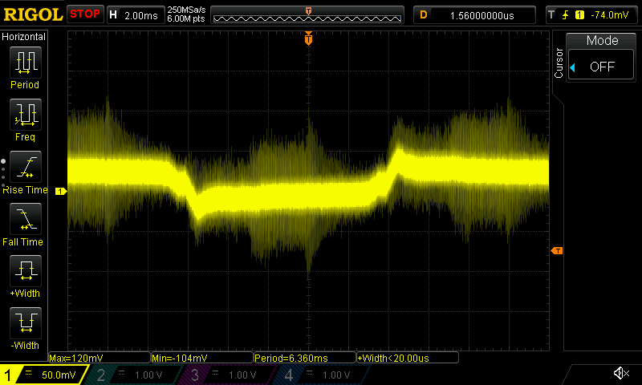

# Measurements

This repository holds electrical measurements.

AC power measurements have been taken with a RIGOL DS1054Z oscilloscope and a
differential probe from Testec, the TT-SI 9001.

**Warning: Never connect your oscilloscope to AC power with standard probes!**
Measuring AC power requires differential probes. For standard probes, the
reference voltage is connected internally to case ground and connecting it to
AC will essentially connect case ground to AC.

## Inrush Current

The measurements were measured over a 0.5 Ω shunt resistor.

| What                            | Inrush Current | Duration |
| --                              | --             | --       |
| MeanWell RS-15-12 power supply  | 30 A           | 1 ms     |
| MeanWell RS-100-5 power supply  | 44 A           | 2.7 ms   |
| MeanWell MDR-10-24 power supply | 35 A           | 1 ms     |
| MeanWell APV-16-12              | 28 A           | 1 ms     |
| Halogen Lamp, 28 W              | 1.8 A          |          |

### MeanWell RS power supplies

Designation of the power supplies: RS-`wattage`-`voltage`

RS-15-5, RS-15-12, RS-25-5, RS-25-48 all show the same inrush current of around
30 A, charging for 1 ms.

RS-100-5 at 44 A, charging for 2.7 ms.

### MeanWell MDR series (DIN rail mount)

MDR-10-24: 35 A, charging for 1 ms.

### MeanWell APV series

APV-16-12: 28 A, charging for 1 ms.

### Philips Classic 28 W Halogen Lamp

Single halogen lamp when turning on: 1.8 A

Single halogen lamp, attached to a phase control dimmer

Three halogen lamps, attached to the same dimmer; 3.8 A

Halogen lamp warming up and internal resistance rising.

## Various measurements

### V-TAC LED lamp, GU 10

